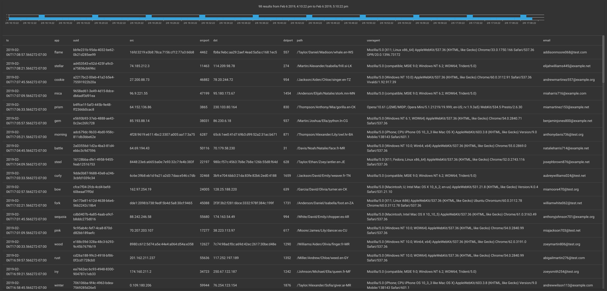

# Gravwell Auto-Extractors

Gravwell enables defining a per-tag extraction definition that can ease the complexity of interacting with unstructure data and data formats that are not self-describing.  Unstructured data often requires complicated regular expressions to extract desired data fields which can be time consuming to produce and prone to errors.

Autoextractors are simply definitions that can be applied to a tag which enable the "ax" module to automatically invoke the functionality of another module.  The autoextractor system supports the following extraction methods:

* [CSV](/search/csv/csv.md)
* [Fields](/search/fields/fields.md)
* [Regex](/search/regex/regex.md)
* [Slice](/search/slice/slice.md)

Auto-extractor definitions are used by the [AX](/search/ax/ax.md) module which transparently references the correct extraction based on tags included in a search.

## Auto-Extractor Configuration

Autoextractors are defined by creating "ax" files and installing them in the "extractions" directory of each Gravwell node.  By default the extractions directory is located at "/opt/gravwell/extractions" but can be configured by setting/modifying the "Autoextract-Definition-Path" confiuration variable in your gravwell.conf file.  Gravwell services must be restarted after changes to any autoextractor "ax" files.

Autoextractor files follow the [TOML V4](https://github.com/toml-lang/toml) format which allows for comments using the "#" character.  Each "ax" file can contain multiple autoextraction definitions and there can be multiple files in the extractions directory.

Note: Only a single extraction can be defined per tag.

Each extractor contains a header and the following parameters:

* tag - The tag associated with the extraction
* name - A human friendly name for the extraction
* desc - A human friendly string that describes the extraction
* module - The processing module used for extraction (regex, slice, csv, fields, etc...)
* args - Module specific arguments used to change the behavior of the extracton module
* params - The extraction definition

Here is a sample autoextraction file designed to pull some basic data from an Apache 2.0 access log using the regex module:

```
#Simple extraction to pull ip, method, url, proto, and status from apache access logs
[[extraction]]
	tag="apache"
	name="apacheaccess"
	desc="Apache 2.0 access log extraction to pull requester items"
	module="regex"
	args="" #empty values can be completely ommited, the regex processor does not support args
	params='^(?P<ip>\d+\.\d+\.\d+\.\d+)[^\"]+\"(?P<method>\S+)\s(?P<url>\S+)\s(?P<proto>\S+)\"\s(?P<status>\d+)'
```

There are a few important notes about how the extraction variables are defined.

1. Each extraction variable must be defined as a string and double or single quoted
2. Double quoted strings are subject string escape rules (pay attention when using regex)
  a.  "\b" would be the "backspace" command (character 0x08) not the literal "\b"
3. Single quoted strings are raw and not subjected to string escape rules

The ability to ignore string escape rules is especially handy for the "regex" processor as it makes heavy use of backlash.

Multiple extractions can be specified in a single file by simply establishing a new "[[extraction]]" header and a new specification.  Here is an example with two extractions in a single file:

```
#Simple extraction to pull ip, method, url, proto, and status from apache access logs
[[extraction]]
	tag="apache"
	name="apacheaccess"
	desc="Apache 2.0 access log extraction to pull requester items"
	module="regex"
	args="" #empty values can be completely ommited, the regex processor does not support args
	params='^(?P<ip>\d+\.\d+\.\d+\.\d+)[^\"]+\"(?P<method>\S+)\s(?P<url>\S+)\s(?P<proto>\S+)\"\s(?P<status>\d+)'

#Extraction to apply names to CSV data
[[extraction]]
	tag="locs"
	name="locationrecords"
	desc="AX extraction for CSV location data"
	module="csv"
	params="date, name, country, city, hash, a comma ,\"field with comma,\""
```

The second extraction for the "locs" tag demonstrates the ommission of non-essential parameters (here we don't specify args) and using backslashes to allow double quotes in strings.  Extractions only have 3 essential parameters:

* module
* params
* tag

## Processor Examples

We will demonstrate a few auto-extraction definitions and compare and contrast queries which accomplish the same outcome with and without autoextractors.  We will also show how to use filters from within AX.

### Regex

Regex may be the most common use for auto-extractors.  Regular expressions are hard to get right, easy to mistype, and difficult to optimize.  If you have a regular expression guru available, they can help you build a blazing fast regular expression that does all manner of efficient and flexible extractions and you can simply deploy it in an autoextraction and forget all about it.

Here is an example entry set that is frankly, a mess (which is not uncommon in custom application logs):

```
2019-02-06T16:57:52.826388-07:00 [fir] <6f21dc22-9fd6-41ee-ae72-a4a6ea8df767> 783b:926c:f019:5de1:b4e0:9b1a:c777:7bea 4462 c34c:2e88:e508:55bf:553b:daa8:59b9:2715 557 /White/Alexander/Abigail/leg.en-BZ Mozilla/5.0 (Linux; Android 8.0.0; Pixel XL Build/OPR6.170623.012) AppleWebKit/537.36 (KHTML, like Gecko) Chrome/60.0.3112.107 Mobile Safari/537.36 {natalieanderson001@test.org}
```

The data is a really ugly access log to some custom application, we are trying to get at a few fields which we will name as follows:

* ts - the timestamp at the beginning of each entry
* app - a string representing the handling application
* uuid - a unique identifier
* src - source address, both IPv4 and IPv6
* srcport - source port
* dst - destination address, both IPv4 and IPv6
* dstport - destination port
* path - URL like path
* useragent - useragent
* email - email address associated with the request

Here is our example extractor definition:

```
[[extraction]]
	module="regex"
	tag="test"
	params='(?P<ts>\S+)\s\[(?P<app>\S+)\]\s<(?P<uuid>\S+)>\s(?P<src>\S+)\s(?P<srcport>\d+)\s(?P<dst>\S+)\s(?P<dstport>\d+)\s(?P<path>\S+)\s(?P<useragent>.+)\s\{(?P<email>\S+)\}$'
```

Lets assume we want to extract every single data item and put them into a table.

If we were to use regex, our query would be:

```
tag=test regex "(?P<ts>\S+)\s\[(?P<app>\S+)\]\s<(?P<uuid>\S+)>\s(?P<src>\S+)\s(?P<srcport>\d+)\s(?P<dst>\S+)\s(?P<dstport>\d+)\s(?P<path>\S+)\s(?P<useragent>.+)\s\{(?P<email>\S+)\}$" | table
```

However, with the auto-extractor and the ax module it can be:

```
tag=test ax | table
```

The results are the same:



If we want to filter on a field using the ax module, we can simply attach a filter directive to the named field on the ax module.  In this example we want to show all entries that have "test.org" in the email address while still rendering a table with all extracted fields.

```
tag=test ax email~"test.org" | table
```

If we only want specific fields, we can specify those fields which directs the ax module to only include those specific fields.

```
tag=test ax email~"test.org" app path | table
```

### 
