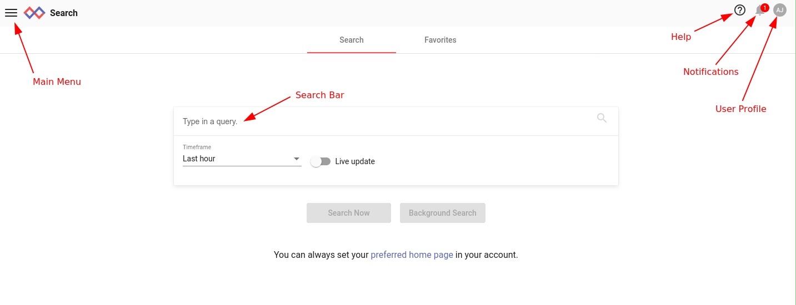
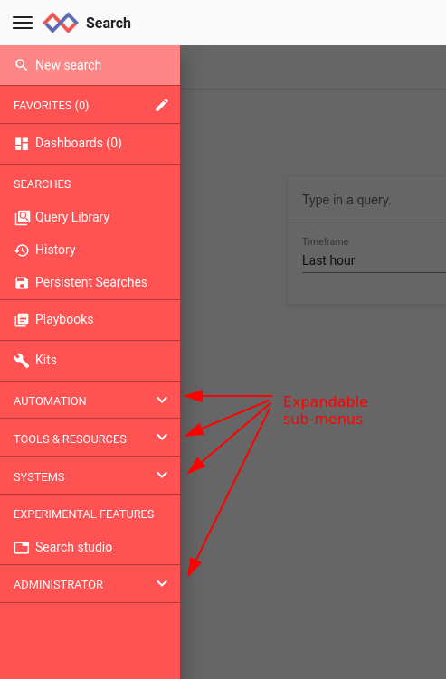
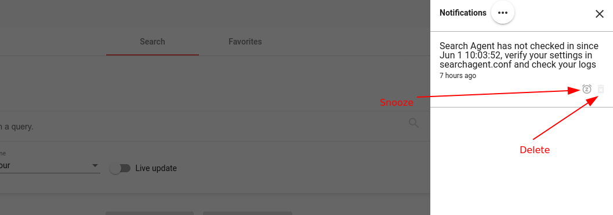
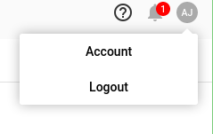
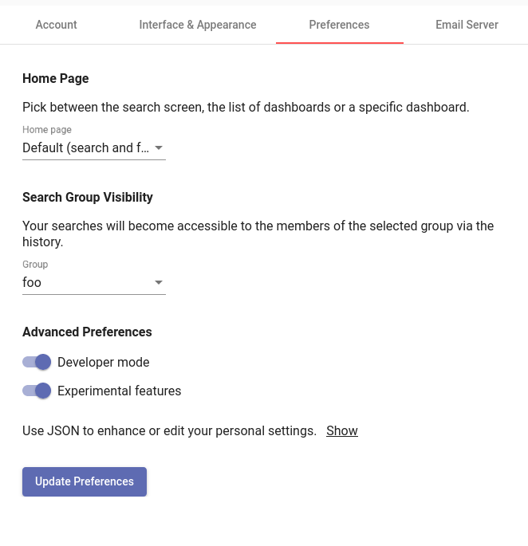
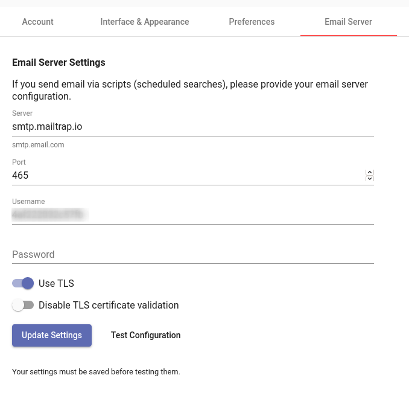

# The Gravwell GUI

Most users will interact with Gravwell through the web GUI. This page describes a few high-level menus and interface concepts; the pages linked below go into detail on other topics.

* [The Search Interface](queries/queries.md)
* [Labels and Filtering](labels/labels.md)
* [Advanced GUI User Preferences](configuration/gui.md)

## GUI Introduction

After logging in, users will by default be directed to the search page, shown below.

The icons along the top (labeled Main Menu, Help, Notifications, and User Profile) are visible at all times within the Gravwell GUI.

## The Main Menu

Clicking the "hamburger" menu in the upper left will open the Main Menu:

This menu is used to access all the primary functionalities of Gravwell, including dashboards, the query library, and playbooks. Note that several items within the menu are actually sub-menus, which can be expanded to show additional options:

Items within these sub-menus will typically be used less frequently that the top-level items.

Note: These screenshots include an "Administrator" sub-menu, which contains admin-only management tools and is only visible to the `admin` user.

## Notifications

Clicking the bell-shaped Notifications icon in the upper right of the screen brings up the Notifications display:

Clicking the "snooze" button on a notification will remove that notification from counter shown on the icon; this can be useful to prevent distractions.

Depending on the type of notification, clicking the "delete" icon may clear the notification entirely. Some notifications are persistent and cannot be deleted; some are system-wide and can only be deleted by the administrator, and some are targeted at the current user and can be deleted by that user. Note that there is no harm in clicking "delete" on a notification the user isn't allowed to delete.

Critical notifications, such as an offline indexer, will change the notification bell into a warning sign:

## User Preferences

Selecting the User Profile icon in the upper right of the screen brings up a small drop-down menu:

### Account

Selecting "Account" will open the current user's preferences page, shown below. Here, the user can change his/her email address, display name, or password; be sure to click "Update Account" after making changes! The "Log out all sessions" button at the bottom of the screen will kick *all* sessions the user has open, across all client machines.

### Interface & Appearance 

The second tab of the Preferences page, "Interface & Appearance", has options for customizing the Gravwell user interface. The "Interface theme" dropdown is of particular interest, as it selects a GUI-wide color scheme (including the ever-popular dark modes). 

The "Chart theme" dropdown selects different color palettes which will be used when drawing charts. The editor theme & font size options control the appearance of Gravwell's built-in text editor, which is used to create SOAR scripts and in a few other places.

### Preferences

The third tab, "Preferences", allows the user to change some default behaviors of Gravwell.

The "Home Page" dropdown menu selects which page will be displayed after logging in or clicking the Gravwell icon next to the main menu. By default, the new search page is shown, but users can chose to be shown a list of dashboards, kits, or playbooks instead.

The "Search Group Visibility" option allows the user to share the results of all searches he/she runs with a given group; this can be a convenient way to collaborate. In the screenshot, the user has selected the group named "foo"; all members of that group will have access to the searches this user runs in the future.

The "Advanced Preferences" section can be ignored by most users. Selecting "Developer mode" enables manual editing of JSON preferences (see [this page](!#configuration/gui.md) for more information), while toggling "Experimental Features" will enable the Experimental Features section in the main menu.

### Email Server

The final tab, "Email Server", is extremely important for users who intend to do automated email alerting via SOAR scripts. It must be set up with a valid SMTP configuration before emails can be sent.

The fields are mostly self-explanatory; "Server" is an SMTP server, "Port" is the port to use for SMTP, "Username" and "Password" authenticate to that server. "Use TLS" should be enabled if the server expects TLS connections. The "Disable TLS certification validation" option is provided in case the server is using self-signed certificates; be cautious enabling this!

Once the fields have been populated, click "Update Settings" to save them, then click "Test Configuration" to send a test email.