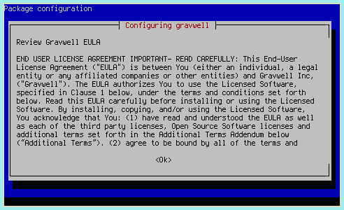
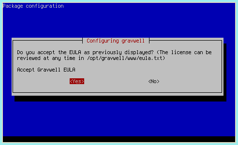

# Gravwell Community Edition

Gravwell's Community Edition is a free licensing program intended for personal use. Unlike regular Gravwell licenses, Community Edition licenses are restricted to 2GB of ingested data per day. In our experience, we've found this to be more than enough for any home network applications (unless you decide to capture all packets and then start streaming Netflix!)

Getting Gravwell Community Edition is straightforward. First, you'll install the software from either our Debian package repository or a distribution-agnostic self-extracting installer. Next, you'll sign up for a free license, which will be emailed to you. Finally, the newly-installed Gravwell instance will prompt you to upload the license file; once it's uploaded, you'll be ready to start using Gravwell!

## Installing the software

Gravwell Community Edition is distributed in two ways: via a distribution-agnostic self-extracting installer, and via a Debian package repository. We recommend using the Debian repository if your system runs Debian or Ubuntu, and the self-extracting installer otherwise.

### Debian repository

Installing from the Debian repository is quite simple:

```
# Get our signing key
curl https://update.gravwell.io/debian/update.gravwell.io.gpg.key | apt-key add -
# Add the repository
echo 'deb http://update.gravwell.io/debian/ community main' > /etc/apt/sources.list.d/gravwell.list
apt-get install apt-transport-https
apt-get update
# Install the package
apt-get install gravwell
```

The installation process will prompt to set some shared secret values used by components of Gravwell. We strongly recommend allowing the installer to generate random values (the default) for security.






### Self-extracting Installer

For non-Debian systems, download the [self-extracting installer](https://update.gravwell.io/files/gravwell_community_2.0.9.tar.bz2) and extract it:

```
curl -O https://update.gravwell.io/files/gravwell_community_2.0.9.tar.bz2
tar xjvf gravwell_community_2.0.9.tar.bz2
```

Then run the installer:

```
sudo bash gravwell_community_2.0.9.sh
```

Follow the prompts and, after completion, you should have a running Gravwell instance.

## Getting a License

To get your license file, head on over to [https://www.gravwell.io/gravwell-community-edition](https://www.gravwell.io/gravwell-community-edition) and fill out the form. Logbot will email one to you shortly therafter.

Once Gravwell is installed, open a web browser and navigate to the server (e.g. [https://localhost/](https://localhost/)). It should prompt you to upload a license file.


Attention: The default username/password for Gravwell is admin/changeme. We highly recommend changing the admin password as soon as possible!

## Start Ingesting!

A freshly installed Gravwell instance, by itself, is boring. You'll want some ingesters to provide data. You can either install them from the Debian repository or head over to [the Downloads page](downloads.md) to fetch self-extracting installers for each ingester.

The ingesters available in the Debian repository can be viewed by running `apt-cache search gravwell`:

```
root@debian:~# apt-cache search gravwell
gravwell - Gravwell community edition (gravwell.io)
gravwell-federator - Gravwell ingest federator
gravwell-file-follow - Gravwell file follow ingester
gravwell-netflow-capture - Gravwell netflow ingester
gravwell-network-capture - Gravwell packet ingester
gravwell-simple-relay - Gravwell simple relay ingester
```

If you install them on the same node as the main Gravwell instance, they should be automatically configured to connect to the indexer, but you'll need to set up data sources for most. See the [ingester configuration documents](#!ingesters/ingesters.md) for instructions on that.

We highly recommend installing the File Follow ingester (gravwell-file-follow) as a first experiment; it comes pre-configured to ingest Linux log files, so you should be able to see some entries immediately by issuing a search such as `tag=auth`:


## Next Steps

Gravwell is a powerful and complex product. It will take time to build expertise, but by starting with simple queries and looking up more complex concepts as needed, you can start answering useful questions immediately!

We recommend starting out with the [Quickstart document](quickstart.md), particularly the [Searching section](quickstart.md#Searching), for some ideas on how to get started. You may need to refer to the [ingester configuration documents](#!ingesters/ingesters.md) to get the data you want into the system.

The [search documentation](#!search/search.md) is the ultimate resource for building search queries; the [Search Modules](#!search/searchmodules.md) and [Render Modules](#!search/rendermodules.md) sections have lots of examples and exhaustive descriptions of the options for each module.

Finally, the [Gravwell blog](https://www.gravwell.io/blog) has case studies and examples showing real-world applications of Gravwell that may serve as inspiration.

Don't hesitate to email info@gravwell.io for help; we're excited to help others explore Gravwell!
