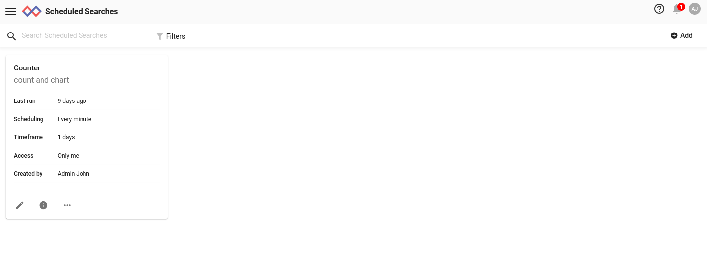
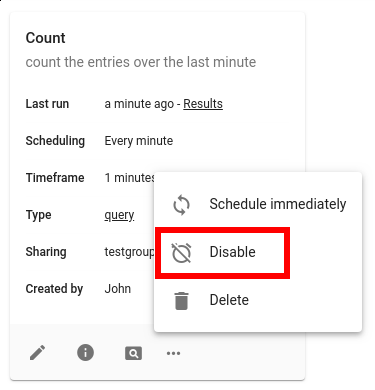

# Scheduling Searches and Scripts with the Search Agent

It is often advantageous to perform searches or run scripts automatically, for instance running a search every morning to detect malicious behavior from the previous night. Using Gravwell's search agent, searches and [search scripts](scriptingsearch.md) can be run on customized scheduled.

The scheduling feature allows the user to schedule both regular searches and [search scripts](scriptingsearch.md).

## Setting up the Search Agent

The Gravwell Search Agent is now included in the main Gravwell install packages and will be installed by default. Disabling the webserver component with the `--no-webserver` flag or setting the `--no-searchagent` flag will disable installation of the Search Agent. The Search Agent is installed automatically by the Gravwell Debian package.

Verify the Search Agent is running with the following command:

```
$ ps aux | grep gravwell_searchagent
```

### Disabling the Search Agent

The Search Agent is installed by default but can be disabled if desired by running the following:

```
systemctl stop gravwell_searchagent.service
systemctl disable gravwell_searchagent.service
```

### Disabling network functions in search agent scripts

By default, scheduled scripts run by the search agent are allowed to use network utilities such as the http library, sftp, and ssh. Setting the option `Disable-Network-Script-Functions=true' in `/opt/gravwell/etc/searchagent.conf` will disable this.

## Managing Scheduled Searches

Scheduled searches are managed from the 'Scheduled Searches' page. The following screenshot shows a single scheduled search which runs every hour:



### Creating a Scheduled Search

To create a new scheduled search, click the 'Add' button in the upper-right corner of the Scheduled Searches page. A new page will open:


The drop-down allows you to switch between running a search query and running a scheduled script; in this case, we will leave it alone. You must provide a search query, specify a timeframe over which it should run, give it a name and description, and define the schedule. You may also optionally chose one or more groups whose members may see the results of this scheduled search.

Note: Gravwell uses the cron schedule format to specify when a search should run. If you're not familiar with cron, check out [the Wikipedia article](https://en.wikipedia.org/wiki/Cron) and try [this site to experiment with scheduling](https://cron.help/)

Below, we have defined a simple scheduled search which runs every minute and counts how many entries came in over the last minute:


Note that we have selected the "run after saving" option. This tells the searchagent to run the search as soon as it can, then begin the regular schedule. This is particularly useful when you're running searches to update a lookup table.

After clicking Save, the search now shows up in the scheduled search listing and will soon run, updating the 'Last Run' field:


### Viewing Search Results

To see the last results of a scheduled search, click the 'View Results' icon:


The most recent set of results for the scheduled search will load:


### Disabling a Scheduled Search

Disabling a scheduled search will prevent it from running again until it is re-enabled. To disable a search, open the three-dot menu to view additional options and select Disable:



To re-enable, repeat the process; rather than "Disable", the menu will say "Enable".

### Scheduling a Search Immediately

You can force a scheduled search to run immediately at any time. Open the three-dot menu for that search and select "Scheduled immediately". The search agent will run the query as soon as possible.


