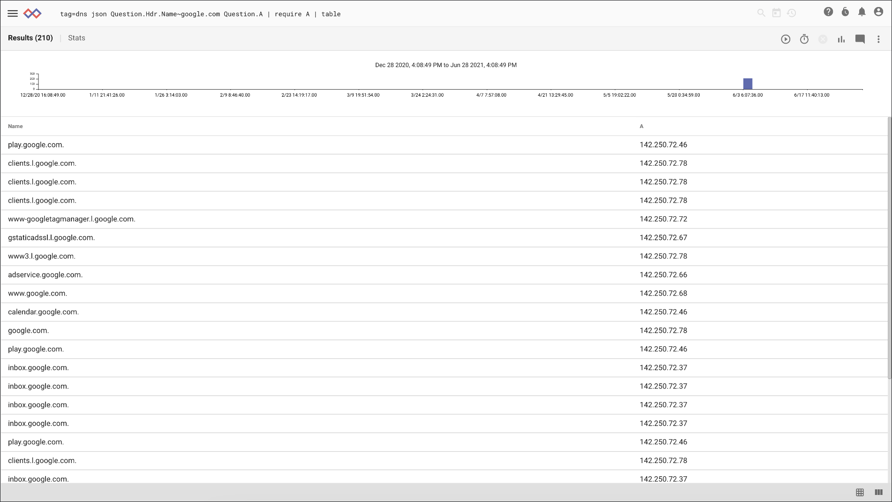
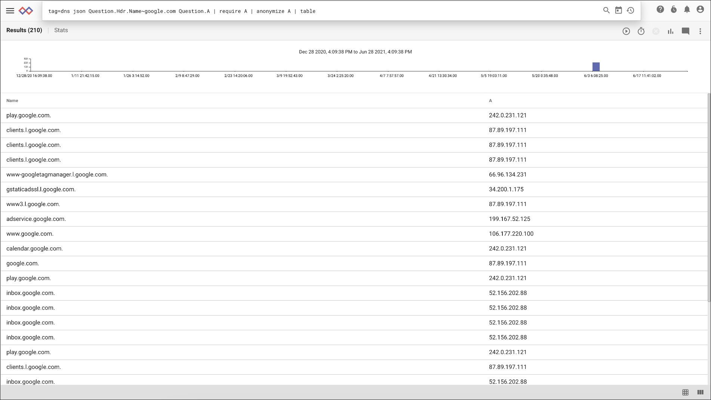
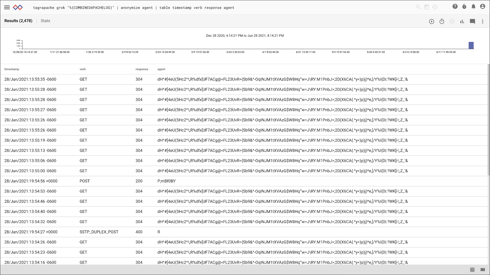

## anonymize

The `anonymize` module is used replace the contents of specified enumerated values with anonymized values. For example, to replace the IP address in a dataset with anonymized addresses:

```
tag=data json IP Message | anonymize IP | table
```

This query will map each entry's IP enumerated value with a random IP address. This way, if the same IP address is seen again, it will receive the same anonymized value. 

The `anonymize` module supports strings, byte arrays, IP addresses, MAC addresses, integers, floating point numbers, and locations. 

### Supported Options

The `anonymize` module takes no flags. Simply specify the enumerated values to anonymize. 

### Example

In this example, we extract request/response pairs from DNS:

```
tag=dns json Question.Hdr.Name~google.com Question.A | require A | table
```



We can anonymize the IP addresses by simply adding the `anonymize` module:

```
tag=dns json Question.Hdr.Name~google.com Question.A | require A | anonymize IP | table
```



The `anonymize` module can also anonymize text. In this example, we extract fields from webserver logs, and anonymize the user agent field. The anonymized text is the same length as the original value. 

```
tag=apache grok "%{COMBINEDAPACHELOG}" | anonymize agent | table timestamp verb response agent
```


