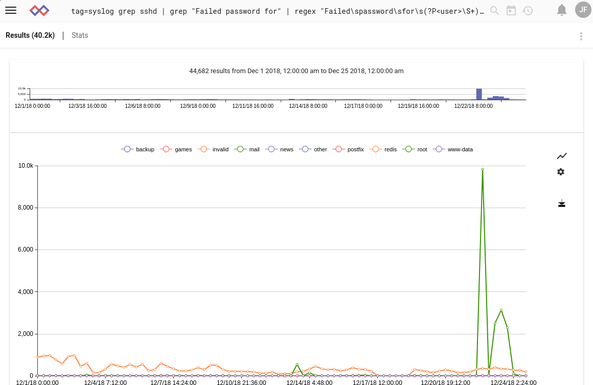
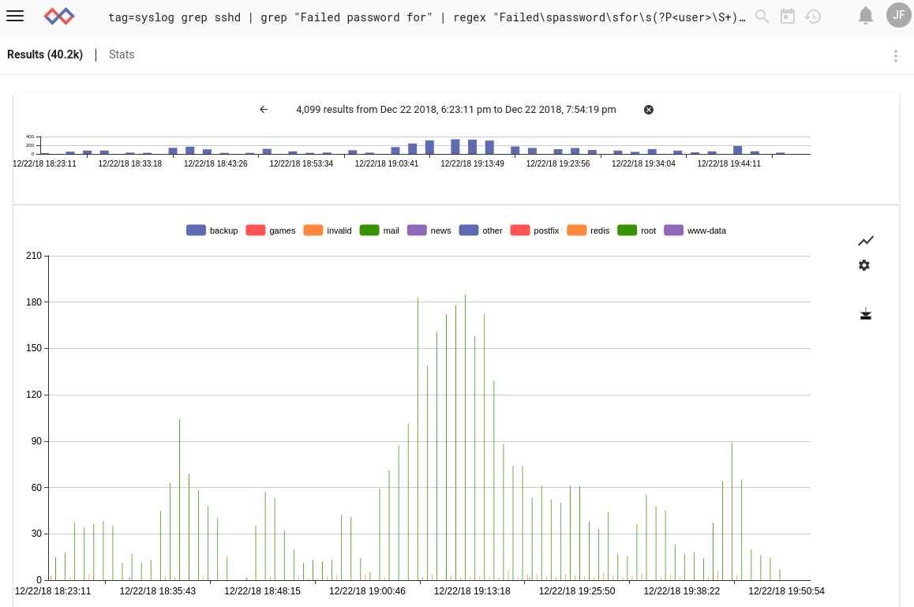
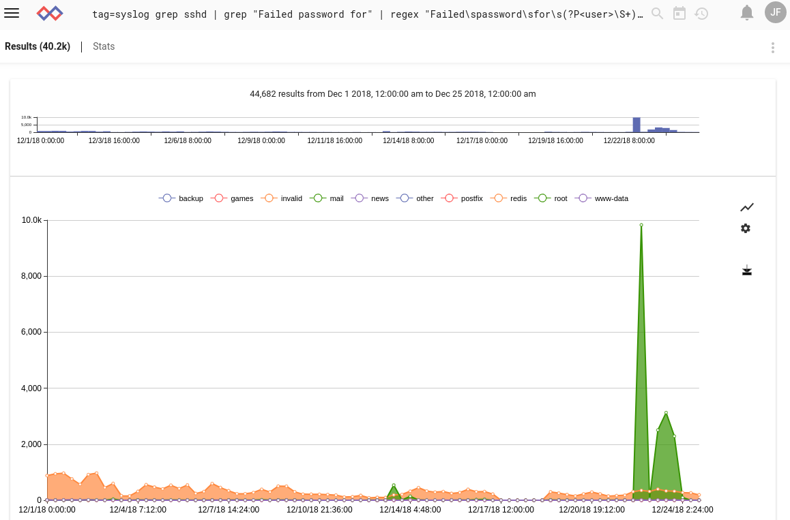

# Chart

The chart renderer is used display aggregate results such as trends, quantities, counts, and other numerical data. Charting will plot an enumerated value with an optional “by” parameter. For example, if there are counts associated with names, `chart count by name` will chart a line for each name showing the counts over time. The charting renderer will automatically limit the plotted lines or bar groups to 8 values. If you would like to see many more lines you can add the `limit <n>` argument which tells the charting library to not introduce the “other” grouping until it exceeds the given limit of `n` values. The user interface for charting allows for a rapid transition between line, area, bar, pie, and donut charts.

## Sample Query

The following query generates a chart showing which usernames most commonly fail ssh authentication; due to online brute-forcing attacks, we can expect "root" to be the most common.

```
tag=syslog grep sshd | grep "Failed password for" | regex "Failed\spassword\sfor\s(?P<user>\S+)" | count by user | chart count by user limit 64
```




