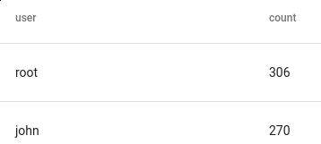

# Table

The table renderer is used to create tables. Building tables is done by providing arguments to the table renderer. Arguments must be enumerated values, TAG, TIMESTAMP, or SRC. Arguments will be used as the columns of the table.

Specifying no column arguments causes table to display all enumerated values as columns instead; this is useful for exploration.

## Supported options

* `-save <destination>`: save the resulting table as a resource for the [lookup module](#!search/lookup/lookup.md). This is a useful way to save the results of one search (say, extracting a MAC->IP mapping from DHCP logs) and use it in later searches.
* `-csv`: In conjunction with the -save flag, save the table in CSV format rather than the native Gravwell format (CSV is also compatible with the lookup module). Useful when exporting data.
* `-nt`: Put the table into non-temporal mode. This causes upstream math modules to condense results rather than having table do it. This can seriously speed up searches over large quantities of data when temporal sub-selection is not needed. It is also currently required when using the [stats module](#!search/stats/stats.md)

## Sample Queries

### Basic table use

Extract a few elements from a Netflow record, then have table automatically display them:

```
tag=netflow netflow Src Dst SrcPort DstPort | table
```

Find brute-force SSH attacks:

```
tag=syslog grep sshd | regex "authentication error for (?P<user>\S+)" | count by user | table user count
```



### Using the -save option

Use DHCP logs to build a lookup table containing IP to MAC mappings:

```
tag=syslog regex "DHCPACK on (?P<ip>\S+) to (?P<mac>\S+)" | unique ip mac | table -save ip2mac ip mac
```

and then use the lookup table to find the MACs associated with SSH logins:

```
tag=syslog grep sshd | regex "Accepted .* for (?P<user>\S+) from (?P<ip>\S+)" | lookup -r ip2mac ip ip mac as mac |table user ip mac
```


### Using the -nt option

In a situation with massive quantities of data, force table into non-temporal mode so the count module will condense results instead:

```
tag=jsonlogs json source | count by source | table -nt source count
```
